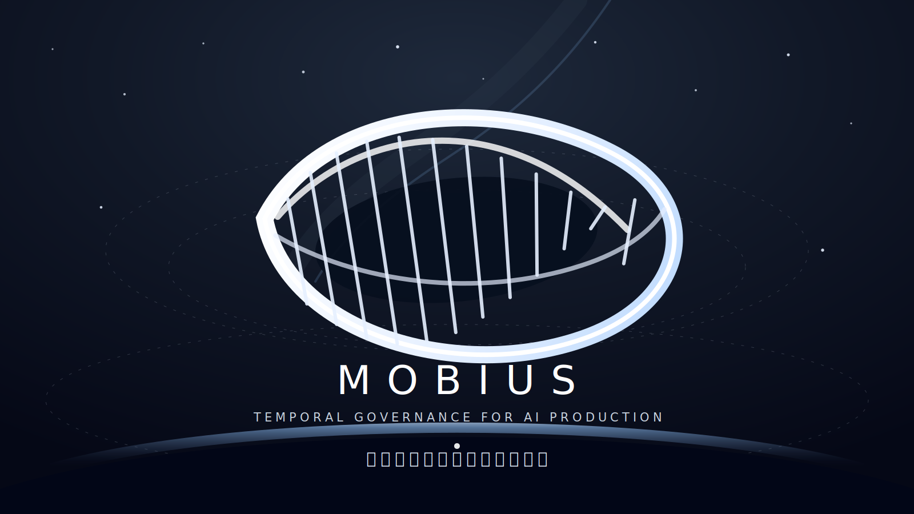
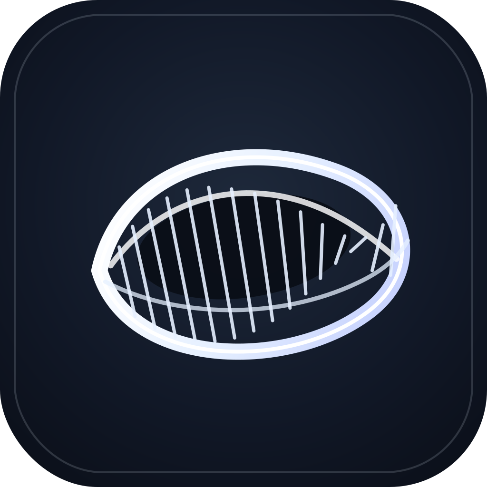

<p align="center">
  
</p>

<p align="center">
  
  
  
  
  
</p>

<p align="center">
  <a href="README.md"><strong>🇬🇧 English</strong></a> ·
  <a href="README.zh.md"><strong>🇨🇳 中文</strong></a> ·
  <a href="README.ja.md"><strong>🇯🇵 日本語</strong></a> ·
  <a href="README.ko.md"><strong>🇰🇷 한국어</strong></a>
</p>

<p align="center">
  
</p>

<h1 align="center">Mobius</h1>
<p align="center"><em>AI 프로덕션을 위한 시간 거버넌스 시스템</em></p>

---

**Mobius는 생성형 시스템을 위한 시간 거버넌스 구조입니다.**

목적이 행동을 제약하고,
증거가 신뢰를 뒷받침하며,
기억이 결과를 보존하고,
경계가 능력을 형성하며,
진화가 미래의 판단을 교정합니다.

영구적인 에이전트를 만들지 않습니다.
일시적인 실행이 증거, 기억, 경계, 능력 또는 명확한 판단으로 시스템에 환원되도록 합니다.

<p align="center">
  <a href="#빠른-시작"><strong>▶ 5분 안에 시작하기</strong></a>
</p>

---

## Mobius가 존재하는 이유

현대 AI 에이전트는 추론, 코딩, 도구 사용, 멀티에이전트 협업에서 빠르게 능력을 향상하고 있습니다. 하지만 능력만으로 AI 프로덕션 프로세스를 신뢰할 수 있게 만들 수는 없습니다.

더 어려운 문제는 거버넌스입니다:

- 목표는 누가 정의하는가?
- 작업은 누가 실행하는가?
- 도구 접근은 누가 허용하는가?
- 결과는 누가 평가하는가?
- 계속, 중지, 재시도, 롤백, 인간에게 인계는 누가 결정하는가?

현재의 에이전트 프레임워크는 "어떻게 실행할 것인가"에 답합니다. Mobius는 "시간을 초월하여 실행을 어떻게 거버넌스할 것인가"에 답합니다.

**Mobius가 존재하는 이유는 AI 프로덕션에 강력한 에이전트뿐만 아니라 모든 행동이 증거, 기억, 경계 또는 더 나은 판단으로 환원됨을 보장하는 시간 지향 거버넌스 구조가 필요하기 때문입니다.**

---

## 빠른 시작

```bash
git clone https://github.com/a672780966/-Harness-OS.git
cd -Harness-OS
# 방법 1: Python CLI (설치 불필요)
python -m harness.copilot.cli version --json
python -m harness.copilot.cli doctor
python -m harness.copilot.cli inspect .
python -m harness.copilot.cli dashboard .
python -m harness.copilot.cli pr-draft --base main

# 방법 2: Node CLI (pnpm + node 필요)
pnpm install
pnpm build
./dist/index.js version --json
./dist/index.js doctor
```

`harness` 명령어를 사용할 수 없는 경우:
```bash
python -m harness.copilot.cli version --json
python -m harness.copilot.cli doctor
```
빌드 후(`pnpm install && pnpm build`), `harness` 바이너리는 `./dist/index.js`에 있습니다.

---

## 핵심 철학

### 목적은 행동에 선행한다 (Purpose Before Action)

모든 실행은 명확한 목적을 위해 존재해야 합니다. 에이전트는 행동하기 전에 왜 시작하는지, 어디로 가는지, 무엇이 완료인지, 무엇을 배반해서는 안 되는지를 알아야 합니다.

### 모든 행동은 환원되어야 한다 (Every Action Must Return)

실행은 항상 결과를 낳습니다. 결과는 일시적 에이전트와 함께 사라져서는 안 됩니다. 증거, 궤적, 위험, 비용, 실패, 경계, 능력으로 시스템에 환원되어야 합니다.

### 증거는 신뢰에 선행한다 (Evidence Before Trust)

AI는 완료를 스스로 증명할 수 없습니다. 에이전트의 주장은 증거가 아닙니다. 신뢰는 trace, diff, test, review, audit, 그리고 고위험 또는 최종 권한 시나리오에서의 인간 승인에서 비롯됩니다.

### 능력은 경계에서 emerges한다 (Capability Emerges from Boundaries)

진정한 능력은 "무엇이든 할 수 있는 것"이 아닙니다. 언제 행동해야 하는지, 어디서 멈춰야 하는지, 무엇에 증거가 필요한지, 무엇을 인간에게 맡겨야 하는지를 아는 것입니다.

### 시스템은 진화해야 한다 (The System Must Evolve)

에이전트는 일시적일 수 있습니다. 워커는 폐기될 수 있습니다. 작업은 종료될 수 있습니다. 그러나 시스템은 정체되어서는 안 됩니다. 모든 행동 후 Mobius는 판단합니다: 이것을 기억으로 침적해야 하는가? 능력을 생성해야 하는가? 경계를 업데이트해야 하는가? 판단을 인간에게 되돌려야 하는가?

---

## 아키텍처

Mobius는 AI 프로덕션 프로세스를 4개의 시간 거버넌스 레이어로 분할합니다.

### Future Layer (목표 제약)
미래는 예측이 아닌 제약입니다. 목적, 목표, 합격 기준, 프로젝트 방향, 불가침 불변 조건을 보존합니다.

### Present Layer (일시적 실행)
현재는 제한된 권한 내에서 일시적 에이전트가 검증 가능한 작업을 실행하는 장소입니다. 작업 실행, 도구 호출, 코드 변경, 테스트 실행, 증거 생성을 담당합니다.

### Past Layer (경험 침적)
과거는 채팅 로그가 아닙니다. 증거로 검증된 시스템 메모리입니다. 실행 궤적, 실패 원인, 수정 경로, 테스트 결과, 감사 이벤트, 결정 기록을 보존합니다.

### Evolution Layer (시스템 진화)
특정 실행에는 참여하지 않으면서 시스템 전체가 개선되고 있는지 판단하는 유일한 레이어입니다.

---

## Harness OS: 참조 구현

Harness OS는 Mobius Architecture의 최초이자 현재 유일한 참조 구현입니다.

Captain, Worker, Audit, StarMap, Loop Controller, Tool Gateway를 포함한 런타임 레이어를 Mobius 원칙을 코드로 강제하는 구체적인 엔지니어링 제품으로 구현합니다.

- **이론적 대체 가능성**: Mobius Architecture는 특정 런타임에 의존하지 않습니다. 다른 구현도 가능합니다.
- **실질적 유일성**: Harness OS는 최초이자 현재 유일한 참조 구현입니다.

Harness OS는 모델 제공자, 범용 코딩 프레임워크, 클라우드 SaaS 제품이 아닙니다. AI 지원 엔지니어링을 위한 로컬 우선 거버넌스 런타임입니다.

---

## 현재 상태

- **베이스라인**: `v1.4-loop-installer-mvp`
- **Copilot 테스트**: `616 passed`
- **전체 테스트**: `848 passed`
- **모드**: local-first semantic copilot

### v1.1 — Real Hermes Loop
그래프 플래너, 루프 러너/컨트롤러, 실행/감사, 평가 트리거 수정, 리뷰 트리거 수정, 파이널 게이트, 증거 팩

### v1.2 — Local Semantic Copilot MVP
프로젝트 검사, diff 요약, 태스크 카드, 병합 준비 상태, 증거 팩, 정적 셸, 실시간 모니터, 에이전트 상태 머신, PR/MR 팩, 제공자 신뢰성 가드, 라이브 대시보드

### v1.3 — 런타임 기반
설정 스키마/로더/리졸버/밸리데이터, 런타임 닥터, 버전 명령어, 제공자 신뢰성 계획

### v1.3.1 — PR 초안 어시스턴트
`harness copilot pr-draft`, GitHub CLI 감지, 수동 폴백 PR 초안 생성, 대용량 파일/캐시 차단 검사

---

## 태그 / 증거 정책

일부 로컬 sealed 태그는 도달 가능한 히스토리에 373MB SWE-bench 증거 아카이브가 포함되어 GitHub에 푸시되지 않습니다. 공개 안전 태그만 푸시됩니다.

---

## 중요 문서

- [v1.3 Main Integration Seal](docs/v1_3_main_integration_seal.md)
- [v1.2 Alpha Final Seal Manifest](docs/v1_2_alpha_final_seal_manifest.md)
- [Public-Safe Evidence Strategy](docs/public_safe_evidence_strategy.md)
