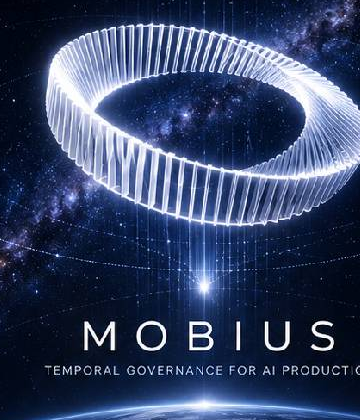

<p align="center">
  
  
  
  
  
</p>

<p align="center">
  <a href="README.md"><strong>🇬🇧 English</strong></a> ·
  <a href="README.zh.md"><strong>🇨🇳 中文</strong></a> ·
  <a href="README.ja.md"><strong>🇯🇵 日本語</strong></a> ·
  <a href="README.ko.md"><strong>🇰🇷 한국어</strong></a>
</p>

<p align="center">
  
</p>
<h1 align="center">Mobius</h1>
<p align="center"><em>Temporal Governance for AI Production</em></p>

---

**Mobius is a temporal governance structure for generative systems.**

It lets purpose constrain action,
evidence ground trust,
memory preserve consequence,
boundaries shape capability,
and evolution refine future judgment.

It does not make agents permanent.
It makes every temporary execution return to the system as evidence, memory, boundary, capability, or an explicit decision.

<p align="center">
  <a href="#quick-start"><strong>▶ Get Started in 5 Minutes</strong></a>
</p>

---

## Why Mobius Exists

Modern AI agents are becoming increasingly capable at reasoning, coding, tool use, and multi-agent collaboration. But capability alone does not make an AI production process trustworthy.

The harder problem is governance:

- Who defines the goal?
- Who executes the task?
- Who grants tool access?
- Who evaluates the result?
- Who decides whether the system should continue, stop, retry, rollback, or learn?

Current agent frameworks answer *how to execute*. Mobius answers *how to govern execution across time*.

**Mobius exists because AI production needs more than capable agents. It needs a time-oriented governance structure that ensures every action returns as evidence, memory, boundary, or better judgment.**

---

## Quick Start

```bash
git clone https://github.com/a672780966/-Harness-OS.git
cd -Harness-OS
# Option 1: Python CLI (no install required)
python -m harness.copilot.cli version --json
python -m harness.copilot.cli doctor
python -m harness.copilot.cli inspect .
python -m harness.copilot.cli dashboard .
python -m harness.copilot.cli pr-draft --base main

# Option 2: Node CLI (requires pnpm + node)
pnpm install
pnpm build
./dist/index.js version --json
./dist/index.js doctor
```

If the `harness` command is not available:
```bash
python -m harness.copilot.cli version --json
python -m harness.copilot.cli doctor
```
After building (`pnpm install && pnpm build`), the `harness` bin is at `./dist/index.js`.

---

## Core Philosophy

### Purpose Before Action

Every execution must serve a defined end, not exist for its own sake. Before any agent acts, it must know: why it starts, where it is going, what counts as done, and what must not be betrayed. Without purpose, action is drift. Without purpose, loops are just spinning.

*Future Layer exists not merely to store requirements, but to preserve purpose, direction, acceptance criteria, and inviolable constraints.*

### Every Action Must Return

Every execution produces consequences. Consequences must not disappear with the temporary agent that caused them. They must return as evidence, trajectory, risk, cost, failure, boundary, or capability. If the system catches the consequence, it becomes order. If not, it returns as noise, drift, debt, or risk.

*Mobius follows a conservation law: no execution truly vanishes. Every action is transformed into order, or returned as chaos.*

### Evidence Before Trust

AI cannot self-certify completion. An agent's claim is not evidence. A model's summary is not fact. Trust comes from trace, diff, test, review, audit, and — for high-risk or final-authority cases — human approval. Without evidence, no completion enters trusted state. Without audit, no result enters system memory. Without verification, no experience enters future judgment.

*Mobius does not trust "looks done." Mobius accepts only "proven done."*

### Capability Emerges from Boundaries

True capability is not "can do everything." It is knowing when to act, how much to do, where to stop, what needs evidence, what must be handed to a human, and what must not be repeated. Success provides paths. Failure provides boundaries. Evidence confirms paths. Memory preserves boundaries. The system generates capability from both.

*Mobius does not record failure as a mere error log. Failure must ultimately transform into boundary — a rule, a permission adjustment, a risk marker, a new capability constraint.*

### The System Must Evolve

Agents can be ephemeral. Workers can be destroyed. A task can end. But the system must not stand still. After every action, Mobius asks: should this be deposited as memory? Should a capability be generated? Should a boundary be updated? Should permissions be adjusted? Should the judgment be handed back to a human? Should this experience be explicitly discarded?

*Evolution is not always accumulation. Sometimes it is remembering. Sometimes it is forgetting. Sometimes it is lowering confidence. Sometimes it is blocking a path. Sometimes it is returning judgment to a human.*

---

## Architecture

Mobius separates AI production into four temporal governance layers.

### Future Layer (Goal Constraint)

The future is not prediction. The future is constraint. Future Layer preserves purpose, objectives, acceptance criteria, project direction, and inviolable invariants. It answers: why start? Where to go? What counts as done? What must not be betrayed? Future Layer does not execute. It prevents execution from drifting.

*Future = Constitution / Spec / Acceptance Criteria / Project Direction*

### Present Layer (Temporary Execution)

The present is not free action. It is a temporary agent executing a verifiable task within limited permissions. Present Layer handles task execution, tool calls, code changes, test runs, local repair, and evidence emission. But it does not hold unlimited permissions. It cannot hold global memory permanently. It cannot bypass Tool Gateway. It cannot self-certify completion. It cannot forge final authority.

*Present = Worker / Tool Execution / Evidence Emission*

### Past Layer (Experience Sedimentation)

The past is not a chat log. It is system memory validated by evidence. Past Layer preserves execution trajectories, failure causes, repair paths, test results, audit events, decisions, capability routes, and risk boundaries. Only experience with a source, confidence level, validity period, verification status, and audit record may enter Past Layer.

*Mobius does not remember everything. Mobius deposits only the facts that can influence future judgment.*

*Past = StarMap / Audit Log / Validated Execution Path / Failure Memory*

### Evolution Layer (System Evolution)

Evolution Layer is the only layer that does not participate in specific execution but judges whether the entire system is improving. It asks: Is the system closer to the purpose? Has a new capability emerged? Has a new boundary been exposed? Has future risk been reduced? Should Future Layer be adjusted? Should authority be returned to a human?

*Evolution = Meta Evaluation / Governance Audit / Sedimentation Decision*

*This is what separates Mobius from ordinary agent frameworks: it does not just explain how agents run. It explains how a generative system can keep evolving.*

---

## Harness OS: Reference Implementation

Harness OS is the first and currently only reference implementation of Mobius Architecture.

It implements the runtime layer — Captain, Worker, Audit, StarMap, Loop Controller, and Tool Gateway — as a concrete engineering product that enforces Mobius principles through code.

- **Theoretically replaceable**: Mobius Architecture does not depend on any specific runtime. Other implementations are possible.
- **Practically singular**: Harness OS is the first and currently only reference implementation. There are no other runtimes today.

Harness OS is **not** a model provider, not a general coding framework, and not a cloud SaaS product. It is a local-first governance runtime for AI-assisted engineering.

---

## Current Status

- **Baseline**: `v1.4-loop-installer-mvp`
- **Latest capability**: `v1.4-loop-installer-mvp`
- **Copilot tests**: `616 passed`
- **Full pytest**: `848 passed`
- **Mode**: local-first, read-only semantic copilot
- **GitHub tag policy**: public-safe tags only; large evidence archives are kept out of Git tags

### v1.1 — Real Hermes Loop
- graph planner, loop runner/controller, executor/auditor
- eval-triggered repair, review-triggered repair
- final gate, evidence pack

### v1.2 — Local Semantic Copilot MVP
- project inspection, diff summary, task cards, merge readiness
- evidence pack, static shell, realtime monitor
- agent state machine, PR/MR pack, provider reliability guard, live dashboard

### v1.2.1 — Dogfood Stabilization
- risk deduplication, source/docs filtering, file type expansion
- false approval-blocking fix, clean-clone idle explanation

### v1.3 — Runtime Foundation
- config schema / loader / resolver / validator
- runtime doctor, version command, provider reliability planning
- cross-project runtime planning, public-safe evidence strategy

### v1.3.1 — PR Draft Assistant
- `harness copilot pr-draft`, GitHub CLI detection
- manual fallback PR draft generation, large-file/cache blocking checks
- optional authenticated `--create`

---

## Tag / Evidence Policy

Some local sealed tags are intentionally **not pushed** to GitHub because their reachable history includes a 373 MB SWE-bench evidence archive, which GitHub rejects due to the 100 MB blob limit.

Public-safe tags are pushed. Large evidence archives should be stored as release assets or external cold archives, while Git keeps manifests and SHA256 references.

---

## Important Docs

- [v1.3 Main Integration Seal](docs/v1_3_main_integration_seal.md)
- [v1.2 Alpha Final Seal Manifest](docs/v1_2_alpha_final_seal_manifest.md)
- [v1.2 Alpha Command Reference](docs/v1_2_alpha_command_reference.md)
- [Public-Safe Evidence Strategy](docs/public_safe_evidence_strategy.md)
- [Public-Safe Tag Mapping](docs/public_safe_tag_mapping.md)
- [Large Evidence Archive Manifest](docs/large_evidence_archive_manifest.md)
- [GitHub Cloud Simulation Report](docs/github_cloud_simulation_report.md)
